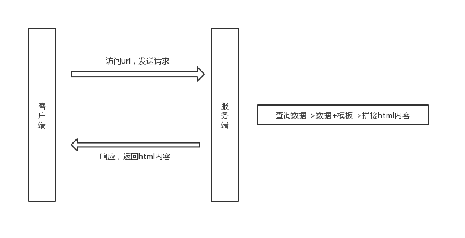
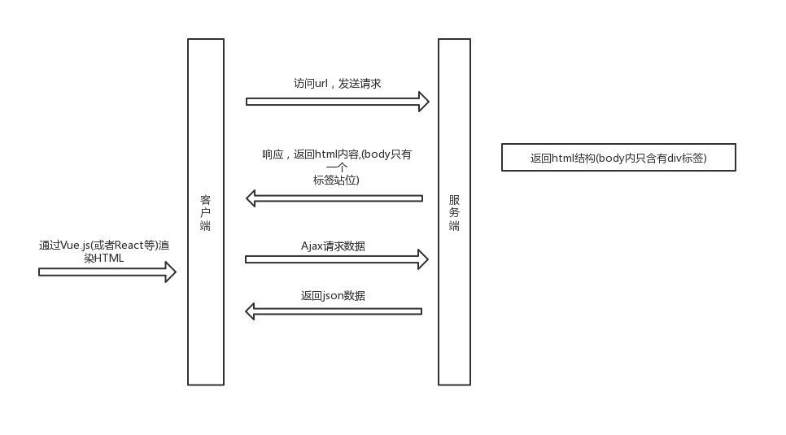
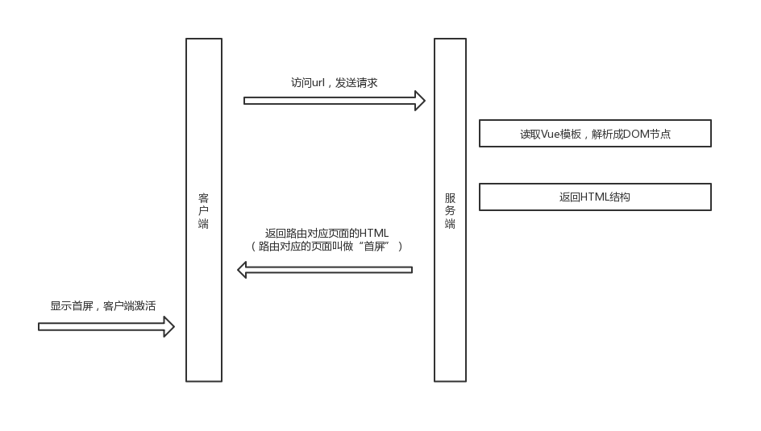

# awesome-ssr
依赖最新的vue-cli3.0，解决了build中遇到的各种问题

### 安装
```
yarn install
```

### 本地开发
```
yarn build && node ./ssr/index.js
//后续会改成热更新和自动重启

```
### 访问地址
```
http://localhost:3000
```

## 理解SSR
### 传统的web开发

Express+EJS 展示
```javascript
const express = require("express");
const ejs = require("ejs");
const app = express();

app.get("/", (req, res) => {
    // 创建用于渲染的数据
    var data = {
        name: "丘比特",
        url: "http://www.cupid.com"
    }
    // 创建模板内容
    var template =`
    <!DOCTYPE html>
      <html lang="en">
      <head>
          <meta charset="UTF-8">
          <title>Title</title>
      </head>
      <body>
          <a href="<%= url %>">
          <p><%= name %></p>
          </a>
      </body>
    </html>
    `
    // 通过ejs.render将数据放到模板中，转为HTML数据
    let html = ejs.render(template, data);
    // 将数据在浏览器进行展现
    res.send(html);
})

app.listen(3001, function () {
    console.log("startindg server...")
})
```
效果：浏览器会拿到全部的DOM结构
```html
    <!DOCTYPE html>
      <html lang="en">
      <head>
          <meta charset="UTF-8">
          <title>Title</title>
      </head>
      <body>
          <a href="http://www.cupid.com">
          <p>丘比特</p>
          </a>
      </body>
    </html>
    
```
```bash
//运行下面命令查看效果
node ./ssr/demo.js
```

### SPA时代
到了vue，react时代，单页应用优秀的用户体验，逐渐成为了主流，页面整体是JS渲染出来的，称之为
客户端渲染CSR

```html
<!-- 源文件路径：./ssr/demo.js -->
<!DOCTYPE html>
<html lang="en">
  <head>
    <meta charset="utf-8">
    <meta http-equiv="X-UA-Compatible" content="IE=edge">
    <meta name="viewport" content="width=device-width,initial-scale=1.0">
    <link rel="icon" href="<%= BASE_URL %>favicon.ico">
    <title>awesome-ssr</title>
  </head>
  <body>
    <noscript>
      <strong>We're sorry but awesome-ssr doesn't work properly without JavaScript enabled. Please enable it to continue.</strong>
    </noscript>
    <div id="app"></div>
    <!-- built files will be auto injected -->
  </body>
</html>
```

### SSR(server side render)
官方文档解释
- [什么是服务器端渲染 (SSR)？](https://ssr.vuejs.org/zh/#%E4%BB%80%E4%B9%88%E6%98%AF%E6%9C%8D%E5%8A%A1%E5%99%A8%E7%AB%AF%E6%B8%B2%E6%9F%93-ssr-%EF%BC%9F)  
大白话：后端渲染出完整的首屏的dom结构返回，前端拿到的内容包括首屏及完整spa结构，应用激活后依然按照spa方式运行，这种页面渲染方式被称为服务端渲染(server side render)

- [为什么使用服务器端渲染 (SSR)？](https://ssr.vuejs.org/zh/#%E4%BB%80%E4%B9%88%E6%98%AF%E6%9C%8D%E5%8A%A1%E5%99%A8%E7%AB%AF%E6%B8%B2%E6%9F%93-ssr-%EF%BC%9F)
- 更好的 SEO，由于搜索引擎爬虫抓取工具可以直接查看完全渲染的页面。
- 更快的内容到达时间 (time-to-content)，特别是对于缓慢的网络情况或运行缓慢的设备




## 循序渐进理解Vue SSR

### 用Vue-cli创建新工程
```bash
vue create hello-ssr
```
### 安装依赖
```bash
yarn add  vue-server-renderer --save
```

### 渲染一个 Vue 实例
```javascript
//源文件路径：./ssr/index2.js
const express = require('express')
const Vue = require('vue')
const path = require('path')

// 实例化服务app
const app = express()
// 第 1 步：创建一个 Vue 实例
const page = new Vue({
  data () {
    return {
      name: 'Cupid'
    }
  },
  template: '<div>{{name}}</div>'
})

const templatePath = path.resolve(__dirname, './template.html')
console.log(templatePath)
// 第 2 步：创建一个 renderer
const renderer = require('vue-server-renderer').createRenderer({
  template: require('fs').readFileSync(templatePath, 'utf-8')
})
app.get('*', (req, res) => {
  // 第 3 步：将 Vue 实例渲染为 HTML
  renderer.renderToString(page, (err, html) => {
    res.send(html)
  })
})

app.listen(3000, () => {
  console.log('Starting...')
})

```

### 路由
你可能已经注意到，我们的服务器代码使用了一个 * 处理程序，它接受任意 URL。这允许我们将访问的 URL 传递到我们的 Vue 应用程序中，然后对客户端和服务器复用相同的路由配置！

为此，建议使用官方提供的 vue-router

### 配置
```javascript
//源文件路径 src/router/index.js
import Vue from 'vue'
import VueRouter from 'vue-router'
import Home from '../views/Home.vue'
import About from '../views/About.vue'

Vue.use(VueRouter)

const routes = [
  {
    path: '/',
    name: 'home',
    component: Home// () => import('../views/Home.vue') //支持路由按需加载
  },
  {
    path: '/about',
    name: 'about',
    component: About// () => import('../views/About.vue')
  }
]

//导出工厂函数
export const createRouter = () => {
  return new VueRouter({
    mode: 'history',
    routes
  })
}

```

### 源码结构
#### [避免状态单例](https://ssr.vuejs.org/zh/guide/structure.html#%E9%81%BF%E5%85%8D%E7%8A%B6%E6%80%81%E5%8D%95%E4%BE%8B)
为每个请求创建一个新的根 Vue 实例
#### [介绍构建步骤](https://ssr.vuejs.org/zh/guide/structure.html#%E4%BB%8B%E7%BB%8D%E6%9E%84%E5%BB%BA%E6%AD%A5%E9%AA%A4)
对于客户端应用程序和服务器应用程序，我们都要使用 webpack 打包 - 服务器需要「服务器 bundle」然后用于服务器端渲染(SSR)，而「客户端 bundle」会发送给浏览器，用于混合静态标记。  

#### [使用 webpack 的源码结构](https://ssr.vuejs.org/zh/guide/structure.html#使用-webpack-的源码结构)
```javascript
src
├── views
│   ├── About.vue
│   ├── Home.vue
│   └── Baz.vue
├── App.vue
├── app.js # 通用 entry(universal entry)
├── entry-client.js # 仅运行于浏览器
└── entry-server.js # 仅运行于服务器
```
### Vue实例创建
`app.js`是负责创建vue实例，每次请求均会有独立的vue实例创建。创建app.js
```javascript
import Vue from 'vue'
import { createRouter } from '@/router'
import App from './App.vue'

// 导出一个工厂函数，用于创建新的
// 应用程序、router 和 store 实例
export function createApp () {
  const router = createRouter()
  const app = new Vue({
    router,
    render: h => h(App) // 根实例简单的渲染应用程序组件。
  })
  // 返回 app 和 router
  return { app, router }
}

```
#### 服务端入口
```javascript
//源文件地址：/src/entry-server.js
// 创建vue实例，做首屏渲染
import { createApp } from './app'

export default (context) => {
  return new Promise((resolve, reject) => {
    const { app, router } = createApp()
    // 跳转首屏
    router.push(context.url)
    router.onReady(() => {
      resolve(app)
    }, reject)
  })
}
```
思考：服务端能执行挂载嘛？为什么

#### 客服端入口
客户端入口只需创建vue实例并执行挂载，这一步称为激活。  
[客户端激活](https://ssr.vuejs.org/zh/guide/hydration.html)，指的是 Vue 在浏览器端接管由服务端发送的静态 HTML，使其变为由 Vue 管理的动态 DOM 的过程。

```javascript
import { createApp } from './app'

const { app, router } = createApp()
router.onReady(() => {
  app.$mount('#app', true)
})
```

#### webpack配置
具体配置：vue.config.js
```javascript
const VueSSRServerPlugin = require('vue-server-renderer/server-plugin')
const VueSSRClientPlugin = require('vue-server-renderer/client-plugin')

const TARGET_NODE = process.env.WEBPACK_TARGET === 'node'
const target = TARGET_NODE ? 'server' : 'client'
console.log(target)

module.exports = {
  css: {
    extract: false
  },
  outputDir: './dist/' + target,
  configureWebpack: () => ({
    // 将 entry 指向应用程序的 server / client 文件
    entry: `./src/entry-${target}.js`,
    // 对 bundle renderer 提供 source map 支持
    devtool: 'source-map',
    // 这允许 webpack 以 Node 适用方式处理动态导入(dynamic import)，
    // 并且还会在编译 Vue 组件时告知 `vue-loader` 输送面向服务器代码(server-oriented code)。
    target: TARGET_NODE ? 'node' : 'web',
    output: {
      // 此处使用 Node 风格导出模块
      libraryTarget: TARGET_NODE ? 'commonjs2' : undefined
    },
    // 服务端默认文件名为 `vue-ssr-server-bundle.json`
    plugins: [TARGET_NODE ? new VueSSRServerPlugin() : new VueSSRClientPlugin()]
  }),
  chainWebpack: config => {
    // https://github.com/vuejs/vue/issues/8488
    if (process.env.NODE_ENV === 'production') { config.optimization.delete('splitChunks') }
    // https://github.com/vuejs/vue-loader/issues/885
    config.module
      .rule('vue')
      .use('vue-loader')
      .loader('vue-loader')
      .tap(options => {
        // 修改它的选项...
        options['optimizeSSR'] = false
        return options
      })
  }
}
```

#### 脚本配置
```bash
yarn add cross-env --save-dev
```
定义脚本
```javascript
"script":{
    "build:client": "vue-cli-service build",
    "build:server": "cross-env WEBPACK_TARGET=node vue-cli-service build",
    "build": "yarn build:server && yarn build:client",
}
//构建打包：yarn build
```

#### 宿主文件
最后定义宿主文件。源文件路径：srr/template.html
 ```html
 <!DOCTYPE html>
<html lang="en">

<head>
  <meta charset="UTF-8">
  <meta name="viewport" content="width=device-width, initial-scale=1.0">
  <meta http-equiv="X-UA-Compatible" content="ie=edge">
  <title>awesome-ssr</title>
</head>

<body>
  <!--vue-ssr-outlet-->
</body>

</html>

 ```

 #### 服务器启动文件
 修改服务器启动文件，现在需要处理所有路由，./ssr/index.js
 ```javascript
const express = require('express')
const fs = require('fs')
const path = require('path')
//
const { createBundleRenderer } = require('vue-server-renderer')

const resolve = dir => {
  return path.resolve(__dirname, dir)
}
// 实例化服务app
const app = express()

const bundle = require(resolve('../dist/server/vue-ssr-server-bundle.json'))
// 把client当成静态服务器地址
app.use(express.static(resolve('../dist/client'), { index: false }))

const renderer = createBundleRenderer(bundle, {
  runInNewContext: false, // 推荐
  template: fs.readFileSync(resolve('./template.html'), 'utf8'), // （可选）页面模板
  clientManifest: require(resolve('../dist/client/vue-ssr-client-manifest.json'))
})

app.get('*', async (req, res) => {
  const context = {
    url: req.url
  }
  const html = await renderer.renderToString(context)
  res.send(html)
})

app.listen(3000, () => {
  console.log('Start Server...')
})
 ```

 #### 引入Vuex模块
 store/index.js
 ```javascript
 import Vue from 'vue'
import Vuex from 'vuex'

Vue.use(Vuex)

const types = {
  'ADD': 'Add',
  'INIT': 'init'
}

export function createStore () {
  return new Vuex.Store({
    state: {
      count: 1
    },
    mutations: {
      [types.ADD] (state) {
        state.count += 2
      },
      [types.INIT] (state, count) {
        state.count = count
      }
    },
    actions: {
      add ({ commit }) {
        commit(types.ADD)
      },
      init ({ commit }, count) {
        commit(types.INIT, count)
      }
    }
  })
}
 ```

 挂载store，app.js
 ```javascript
import Vue from 'vue'
import { createRouter } from '@/router'
//新增
import { createStore } from '@/store'
import App from './App.vue'

export function createApp (context) {
  const router = createRouter()
  //新增
  const store = createStore()
  const app = new Vue({
    router,
    store,
    context,
    render: h => h(App)
  })
  // 返回 app 和 router
  return { app, router, store }
}
 ```
 在vue文件中使用
 ```javascript
 <template>
  <div class="home">
    Hello,Everybody!
    <div>
      数量：{{count}}
      <button @click="onClickButton">增加2</button>
    </div>
  </div>
</template>

<script>
import { mapState, mapActions } from 'vuex'
export default {
  name: 'Home',
  computed: {
    ...mapState(['count'])
  },
  methods: {
    ...mapActions(['add']),
    onClickButton () {
      this.add()
    }
  }
}
</script>

 ```
 #### 数据获取
[服务器端数据预取](https://ssr.vuejs.org/zh/guide/data.html#%E6%9C%8D%E5%8A%A1%E5%99%A8%E7%AB%AF%E6%95%B0%E6%8D%AE%E9%A2%84%E5%8F%96-server-data-fetching)
```javascript
import Vue from 'vue'
import Vuex from 'vuex'

Vue.use(Vuex)

const types = {
  'ADD': 'Add',
  'INIT': 'init'
}

export function createStore () {
  return new Vuex.Store({
    state: {
      count: 1
    },
    mutations: {
      [types.ADD] (state) {
        state.count += 2
      },
      [types.INIT] (state, count) {
        state.count = count
      }
    },
    actions: {
      add ({ commit }) {
        commit(types.ADD)
      },
      init ({ commit }, count) {
        commit(types.INIT, count)
      },
      // 新增：模拟数据请求 
      ajaxData ({ commit }) {
        return new Promise((resolve, reject) => {
          setTimeout(() => {
            console.log('ajax data')
            // 更新store数据
            let data = Math.random()
            commit(types.INIT, data)
            resolve()
          }, 1000)
        })
      }
    }
  })
}

```
组件中的数据预取逻辑，Home.vue
```javascript
<template>
  <div class="home">
    Hello,Everybody!
    <div>
      数量：{{count}}
      <button @click="onClickButton">增加2</button>
    </div>
  </div>
</template>

<script>
import { mapState, mapActions } from 'vuex'
export default {
  name: 'Home',
  computed: {
    ...mapState(['count'])
  },
  // store和route是传送进来的，route为了获取参数
  asyncData ({ store, route }) {
    // 模拟异步请求,返回Promise
    // return new Promise((resolve, reject) => {
    //   setTimeout(() => {
    //     resolve(10)
    //   })
    // })
    return store.dispatch('ajaxData')
  },
  methods: {
    ...mapActions(['add']),
    onClickButton () {
      this.add()
    }
  }
}
</script>
```
[服务端数据预取](https://ssr.vuejs.org/zh/guide/data.html#%E6%9C%8D%E5%8A%A1%E5%99%A8%E7%AB%AF%E6%95%B0%E6%8D%AE%E9%A2%84%E5%8F%96-server-data-fetching)，entry-server.js
```javascript
// entry-server.js
// 创建vue实例，做首屏渲染
import { createApp } from './app'

export default (context) => {
  return new Promise((resolve, reject) => {
    const { app, router, store } = createApp(context)
    // 跳转首屏
    router.push(context.url)
    router.onReady(() => {
      // 获取匹配的路由组件数据
      const matchedComponents = router.getMatchedComponents()
      if (!matchedComponents.length) {
        return reject({ code: 404 })
      }

      // 对所有匹配的路由组件调用 `asyncData()`
      Promise.all(matchedComponents.map(Component => {
        if (Component.asyncData) {
          // 返回一个promise
          return Component.asyncData({
            store,
            route: router.currentRoute
          })
        }
      })).then(() => {
        // 在所有预取钩子(preFetch hook) resolve 后，
        // 我们的 store 现在已经填充入渲染应用程序所需的状态。
        // 当我们将状态附加到上下文，
        // 并且 `template` 选项用于 renderer 时，
        // 状态将自动序列化为 `window.__INITIAL_STATE__`，并注入 HTML。
        context.state = store.state
        resolve(app)
      })
    }, reject)
  })
}
```
客户端在挂载到应用程序之前，store 就应该获取到状态，entry-client.js
```javascript
import { createApp } from './app'

const { app, router, store } = createApp()
// 当使用 template 时，context.state 将作为 window.__INITIAL_STATE__ 状态自动嵌入到最终的 HTML // 在客户端挂载到应用程序之前，store 就应该获取到状态：
if (window.__INITIAL_STATE__) {
  store.replaceState(window.__INITIAL_STATE__)
}

router.onReady(() => {
  app.$mount('#app', true)
})
```

[客户端数据预取处理](https://ssr.vuejs.org/zh/guide/data.html#%E5%AE%A2%E6%88%B7%E7%AB%AF%E6%95%B0%E6%8D%AE%E9%A2%84%E5%8F%96-client-data-fetching)，app.js

```javascript
import Vue from 'vue'
import { createRouter } from '@/router'
import { createStore } from '@/store'
import App from './App.vue'

// 客户端挂载之前，检查组件是否存在异步数据获取
Vue.mixin({
  beforeMount () {
    console.log('beforeMount')
    const { asyncData } = this.$options
    if (asyncData) {
      // 将获取数据操作分配给 promise
      // 以便在组件中，我们可以在数据准备就绪后
      // 通过运行 `this.dataPromise.then(...)` 来执行其他任务
      this.dataPromise = asyncData({
        store: this.$store,
        route: this.$route
      })
    }
  }
})

export function createApp (context) {
  const router = createRouter()
  const store = createStore()
  const app = new Vue({
    router,
    store,
    context,
    render: h => h(App)
  })
  // 返回 app 和 router
  return { app, router, store }
}
```